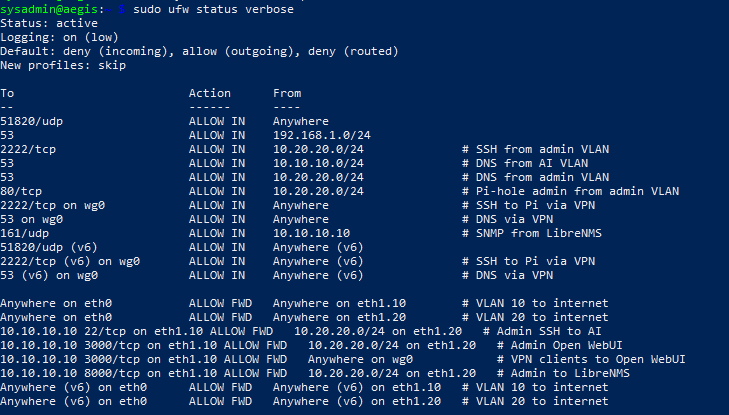
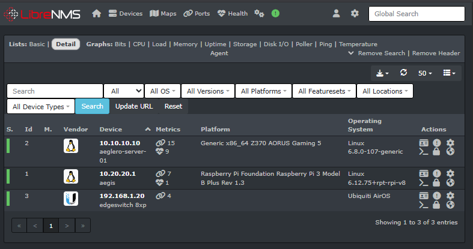
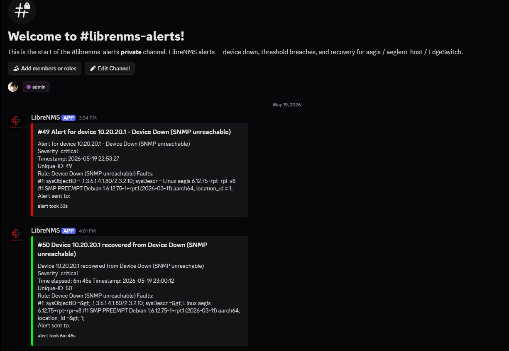

# Private AI Infrastructure

A self-hosted, security-hardened AI inference environment built on bare
metal with zero cloud dependency. Designed using defense-in-depth
architecture patterns appropriate for regulated environments where data
residency and privacy are non-negotiable.

## Architecture


True L3 VLAN segmentation across three trust zones, with all inter-VLAN
traffic enforced by a stateful firewall on a Raspberry Pi acting as a
router-on-a-stick. Remote access via a single WireGuard endpoint. SNMP
monitoring with Discord-delivered alerts.

---

## VLAN Design

| VLAN | Purpose | Subnet | Members |
|---|---|---|---|
| 10 | AI Inference | 10.10.10.0/24 | aeglero-host (production workloads) |
| 20 | Admin | 10.20.20.0/24 | aeglero-admin (sole administrative client) |
| 30 | Egress | 192.168.1.0/24 | Spectrum router, aegis eth0, WiFi devices, switch management |
| — | WireGuard tunnel | 10.0.0.0/24 | Remote VPN clients |

WiFi devices have **no L2 or L3 path** to the AI or admin VLANs.
Inter-VLAN traffic that crosses zones is gated by an explicit-allow
firewall on the Pi.

---

## Stack

### Compute Host (aeglero-host)
Bare-metal Ubuntu Server on VLAN 10. Multi-purpose production host.

- **Ollama** (llama.cpp-backed) with CUDA — dual GPU tensor splitting across GTX 1080 + GTX 1660 Super
- **Open WebUI** — browser-based chat interface (Docker)
- **Continue.dev** — AI-assisted development integration
- **LibreNMS** — SNMP-based network monitoring (Docker, with MariaDB + Redis + dispatcher sidecars)
- 16 GB DDR4, Z370 motherboard, i7-8700

### Security Gateway (aegis)
Raspberry Pi 3B+ with two NICs (built-in + USB-ethernet).

- **L3 router-on-a-stick** between VLANs via 802.1Q sub-interfaces
- **WireGuard VPN** — sole encrypted entry point from the internet (UDP 51820)
- **Pi-hole** — network-wide DNS filtering served to all VLANs
- **UFW** — stateful firewall: default deny incoming, default deny routed
- **Fail2ban** — SSH brute-force protection
- **SSH bastion** — key-only auth on non-standard port

### Network Infrastructure
- **Ubiquiti EdgeSwitch 8XP** — managed gigabit, 802.1Q VLAN tagging
- **Spectrum router + Hitron modem** — ISP edge

### Observability
- **LibreNMS** containerized on aeglero-host
- Polls aegis, aeglero-host, and the EdgeSwitch every 5 minutes via SNMP
- **Discord webhook** transport for alert notifications
- Active alert rules: Device Down (SNMP), Device Rebooted, High Memory, Port Saturation

---

## Screenshots

[`docs/screenshots/`](docs/screenshots/) demonstrate
each architectural claim.

### L2 segmentation at the switch


EdgeSwitch 8XP VLAN configuration. Port 1 (Spectrum uplink, untagged
VLAN 30), Port 2 (AI server, untagged VLAN 10), Port 3 (admin
workstation, untagged VLAN 20), Port 4 (Pi eth0, untagged VLAN 30),
Port 5 (Pi USB-eth trunk, tagged VLAN 10 + 20), Port 6 (other-room,
untagged VLAN 30). Management interface bound to VLAN 30.

### Stateful firewall on the L3 boundary



UFW configuration on aegis. Default deny incoming + default deny
routed; explicit allow rules for each permitted flow. Cross-VLAN
forwards limited to specific (source subnet, destination IP, port,
protocol) tuples. See [`network/ufw-rules.md`](network/ufw-rules.md)
for the full rule set.

### SNMP polling across VLANs



All three infrastructure devices polled successfully via SNMP from the
containerized LibreNMS instance on aeglero-host. Cross-VLAN polling is
gated by a single explicit firewall rule on the Pi:
`allow from 10.10.10.10 to port 161/udp`.

Per-device monitoring view. CPU per-core
temperatures, memory utilization breakdown, storage usage, and detected
interfaces — all collected via SNMP, RRD-backed for historical graphs.

### End-to-end alert delivery



Alert pipeline working end-to-end: failed SNMP poll → LibreNMS rule
evaluation → Discord webhook (HTTPS POST) → notification delivered
off-network with severity, timestamp, rule attribution, and recovery
events.

---

## Security Model

### Layered defense in depth

1. **Physical / L2.** Managed switch with strict VLAN port assignments. WiFi devices physically cannot place packets on the AI or admin broadcast domains.
2. **L3 routing.** Spectrum router has no route to internal VLAN subnets. Only the Pi knows how to route between VLANs.
3. **Stateful firewall.** UFW route-allow rules permit specific inter-VLAN flows by five-tuple (src IP, dst IP, src port, dst port, proto). Default deny on the FORWARD chain.
4. **NAT.** Source-IP rewriting on egress hides internal subnet structure from upstream networks.
5. **INPUT firewall on the Pi.** SSH (2222), DNS (53), Pi-hole admin (80) restricted by source VLAN. WiFi clients limited to DNS only.
6. **Service authentication.** SSH key-only, Pi-hole admin password, Open WebUI auth, Fail2ban brute-force protection.

### Attack surface

The only port exposed to the public internet is **UDP 51820 (WireGuard)**.
All other services are reachable only:
- From specific internal VLANs, gated by the Pi's firewall
- From authenticated WireGuard tunnel clients

See [`docs/threat-model.md`](docs/threat-model.md) for the full threat
analysis and trust-zone matrix.

---

## Project Status

### Deployed
- [x] Bare-metal Ubuntu Server with Ollama (CUDA, dual GPU)
- [x] Open WebUI + Continue.dev for AI workflows
- [x] WireGuard VPN gateway with single-port public exposure
- [x] Pi-hole DNS filtering served to all VLANs
- [x] UFW + Fail2ban host firewall and brute-force protection
- [x] SSH hardening (key-only, non-standard port)
- [x] Wake-on-LAN remote management (VPN-accessible)
- [x] Ubiquiti EdgeSwitch 8XP with 802.1Q VLAN tagging
- [x] **L2 VLAN segmentation across three trust zones**
- [x] **L3 inter-VLAN routing via Pi (router-on-a-stick)**
- [x] **Stateful inter-VLAN firewall with default-deny forwarding**
- [x] **NAT egress for isolated VLANs**
- [x] **LibreNMS network monitoring (SNMP, containerized)**
- [x] **Discord-delivered alert notifications (webhook transport)**

### Roadmap
- [ ] LocalStack — AWS API simulation environment for cloud-application testing
- [ ] Migration of L3 routing to a dedicated firewall appliance (removes the Pi as single point of failure)

---

## Hardware

| Device | Role | Specs |
|---|---|---|
| aeglero-host | Compute host (AI + monitoring) | i7-8700, GTX 1080, GTX 1660 Super, 16 GB DDR4 |
| aegis | Security gateway + L3 router | Raspberry Pi 3B+, 1 GB RAM, USB-eth trunk |
| aeglero-admin | Admin workstation | i7-7700k, RX 7600, 32 GB DDR4 |
| EdgeSwitch 8XP | Managed switch | 8-port gigabit, 802.1Q |

---

## Repository Layout

```
docs/
├── architecture.md         # Topology and design rationale
├── architecture.png        # Network diagram (logical + physical view)
├── inter-vlan-routing.md   # Pi as L3 router — interface, NAT, firewall implementation
├── monitoring.md           # LibreNMS deployment, SNMP setup, alert pipeline
├── network-reference.md    # IP/port/VLAN reference tables
├── runbook.md              # Operational procedures and troubleshooting
├── threat-model.md         # Threats, mitigations, trust zones
├── build-log.md            # Hardware sourcing and bring-up notes
└── screenshots/            # Verification artifacts

network/
├── ufw-rules.md            # INPUT, FORWARD, NAT rule reference
└── wireguard/
    └── wg0.conf.example    # WireGuard config template

security/
├── ssh-hardening.md        # sshd_config changes
├── fail2ban.md             # Fail2ban jail config
└── ufw-setup.md            # UFW installation procedure

pi-setup/
└── pihole-setup.md         # Pi-hole installation and config

scripts/
└── aliases.sh              # SSH and operational shortcuts

LICENSE                     # MIT
README.md
```

---

## License

MIT — see [`LICENSE`](LICENSE).
