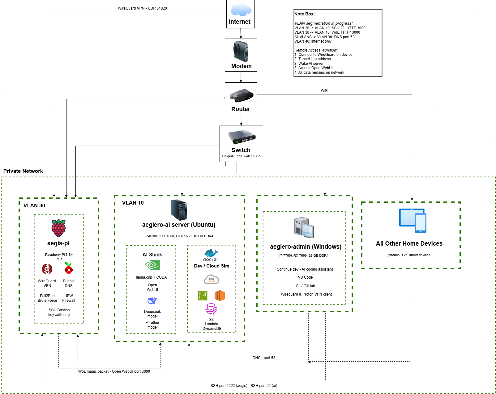

# Private AI Infrastructure

A self-hosted, security-hardened AI inference environment 
built on bare metal with zero cloud dependency. Designed 
with industry regulated architecture patterns for private AI 
deployment in regulated contexts.

## Architecture

## Stack

### AI Inference (aeglero-ai)
- llama.cpp with CUDA — dual GPU tensor splitting
- GTX 1080 + GTX 1660 Super
- Open WebUI — browser based chat interface
- Continue.dev — AI assisted development
- DeepSeek + additional models
- Docker + LocalStack — local AWS simulation

### Network Security (aegis)
- Raspberry Pi 3B+
- WireGuard VPN — single encrypted entry point
- Pi-hole — network wide DNS ad blocking
- Fail2ban — brute force protection
- UFW — firewall, deny all except explicit rules
- SSH Bastion — key auth only, port 2222

### Network Infrastructure
- Ubiquiti EdgeSwitch 8XP — managed gigabit switch
- VLAN segmentation (in progress)
- Spectrum Router + Hitron Modem

## Security Architecture
- Zero public exposure of AI inference server
- Single VPN entry point via WireGuard (UDP 51820)
- DNS level ad and tracker blocking via Pi-hole
- Brute force protection via Fail2ban
- Key only SSH on non-standard port
- UFW default deny all incoming

## HIPAA Relevance
All AI inference runs locally — no PHI ever leaves 
the network. See docs/hipaa-relevance.md for full 
compliance architecture notes.

## Project Status
- [x] Bare metal Ubuntu Server deployment
- [x] llama.cpp with CUDA dual GPU inference
- [x] Open WebUI + Continue.dev
- [x] WireGuard VPN gateway (aegis)
- [x] Pi-hole network wide DNS filtering
- [x] UFW + Fail2ban security hardening
- [x] SSH hardening — key only, port 2222
- [x] Wake-on-LAN remote management
- [x] Ubiquiti EdgeSwitch 8XP deployment
- [ ] VLAN segmentation (in progress)
- [ ] LibreNMS network monitoring
- [ ] Proxmox VM isolation
- [ ] LocalStack AWS simulation environment

## Hardware
| Device | Role | Specs |
|---|---|---|
| aeglero-ai | AI Server | i7-8700, GTX 1080, GTX 1660, 16GB DDR4 |
| aegis | Security Gateway | Raspberry Pi 3B+, 1GB RAM |
| aeglero-admin | Admin Workstation | i7-7700k, RX 7600, 32GB DDR4 |
| EdgeSwitch 8XP | Managed Switch | 8-port gigabit, passive PoE |