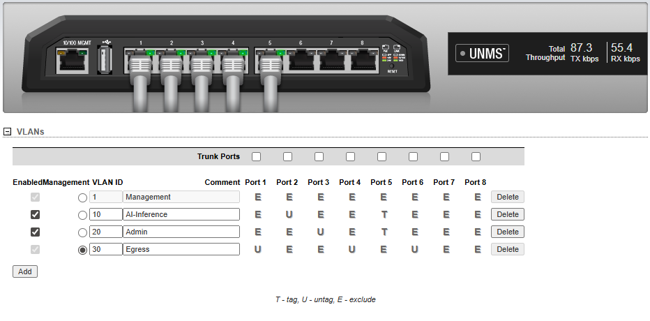

# Private AI Infrastructure

A self-hosted, security-hardened AI inference environment
built on bare metal with zero cloud dependency. Designed
using regulated-industry architecture patterns (zero-trust-
adjacent, defense-in-depth) for private AI deployment in
HIPAA-relevant contexts.

## Architecture

True L3 VLAN segmentation across three trust zones, with all
inter-VLAN traffic enforced by a stateful firewall on a
Raspberry Pi acting as a router-on-a-stick.

## Stack

### AI Inference (aeglero-ai)
- Bare-metal Ubuntu Server, isolated on VLAN 10 (10.10.10.0/24)
- llama.cpp with CUDA, dual GPU tensor splitting
- GTX 1080 + GTX 1660 Super
- Open WebUI — browser-based chat interface
- Continue.dev — AI-assisted development
- DeepSeek-Coder and additional open models
- Docker container runtime

### Security Gateway (aegis)
- Raspberry Pi 3B+, dual-NIC (built-in + USB-eth)
- Acts as the L3 router between VLANs (router-on-a-stick)
- WireGuard VPN — single encrypted entry point from internet
- Pi-hole — network-wide DNS filtering, served to all VLANs
- Fail2ban — brute-force protection
- UFW — stateful firewall, default deny, deny-by-default forwarding
- SSH bastion — key-only auth on non-standard port

### Network Infrastructure
- Ubiquiti EdgeSwitch 8XP — managed gigabit, 802.1Q VLAN tagging
- VLAN segmentation across production / admin / egress zones
- Spectrum Router + Hitron Modem (ISP edge)

## VLAN Design
- **VLAN 10 — AI Inference** (10.10.10.0/24) — bare-metal AI server, isolated
- **VLAN 20 — Admin** (10.20.20.0/24) — admin workstation
- **VLAN 30 — Egress** (192.168.1.0/24) — shared with Spectrum router and WiFi devices
- WireGuard tunnel (10.0.0.0/24) — remote VPN clients

Traffic between VLANs is routed by the Pi and gated by an explicit-allow
firewall. WiFi devices have **no L2 or L3 path** to the AI or admin VLANs.

## Security Architecture
- Zero public exposure of AI inference server
- Single VPN entry point via WireGuard (UDP 51820)
- Stateful inter-VLAN firewall on the Pi — default-deny forwarding
- Admin workstation isolated from untrusted WiFi clients
- AI server unreachable from WiFi (no route exists)
- DNS-level ad and tracker blocking via Pi-hole, served to all VLANs
- Brute-force protection via Fail2ban
- Key-only SSH on non-standard port
- UFW default deny incoming, restricted by source subnet

## Verification

Proof artifacts in [`docs/screenshots/`](docs/screenshots/) demonstrate the
segmentation and routing claims above:

*EdgeSwitch 8XP VLAN configuration showing port-to-VLAN assignments:
Port 1 (Spectrum uplink, untagged VLAN 30), Port 2 (AI server, untagged
VLAN 10), Port 3 (admin workstation, untagged VLAN 20), Port 4 (Pi eth0,
untagged VLAN 30), Port 5 (Pi USB-eth trunk, tagged VLAN 10 + 20),
Port 6 (other-room, untagged VLAN 30). Management VLAN on VLAN 30.*

Additional verification artifacts (Pi firewall rules, routing table, NAT
counters, end-to-end traffic tests, and negative-proof screenshots
demonstrating WiFi isolation from the AI VLAN) to be added in
[`docs/screenshots/`](docs/screenshots/).

## HIPAA Relevance
All AI inference runs on-premise — no PHI ever leaves the
network. The dedicated AI VLAN is structurally isolated from
untrusted WiFi devices, providing a defensible boundary for
sensitive workloads. Full compliance architecture notes in progress.

## Project Status
### Deployed
- [x] Bare metal Ubuntu Server deployment
- [x] llama.cpp with CUDA dual GPU inference
- [x] Open WebUI + Continue.dev
- [x] WireGuard VPN gateway (aegis)
- [x] Pi-hole network-wide DNS filtering
- [x] UFW + Fail2ban security hardening
- [x] SSH hardening — key only, port 2222
- [x] Wake-on-LAN remote management (VPN-accessible)
- [x] Ubiquiti EdgeSwitch 8XP deployment
- [x] **L2 VLAN segmentation (802.1Q tagging)**
- [x] **L3 inter-VLAN routing via Pi (router-on-a-stick)**
- [x] **Stateful inter-VLAN firewall enforcement**
- [x] **NAT egress for isolated VLANs**

### Roadmap
- [ ] LibreNMS network monitoring
- [ ] Proxmox VM isolation
- [ ] LocalStack AWS simulation environment
- [ ] Migrate L3 routing to dedicated firewall appliance (long-term)

## Hardware
| Device | Role | Specs |
|---|---|---|
| aeglero-ai | AI Server | i7-8700, GTX 1080, GTX 1660, 16GB DDR4 |
| aegis | Security Gateway + L3 Router | Raspberry Pi 3B+, 1GB RAM, USB-eth trunk |
| aeglero-admin | Admin Workstation | i7-7700k, RX 7600, 32GB DDR4 |
| EdgeSwitch 8XP | Managed Switch | 8-port gigabit, 802.1Q |
